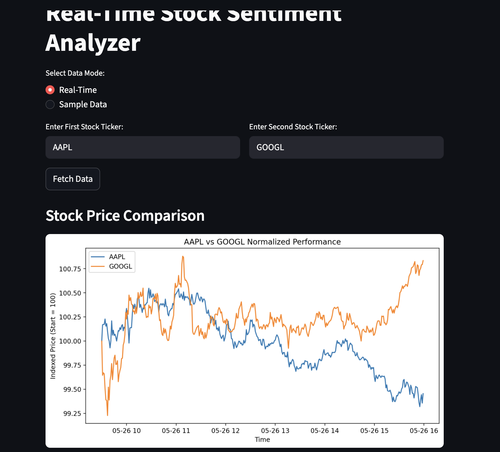
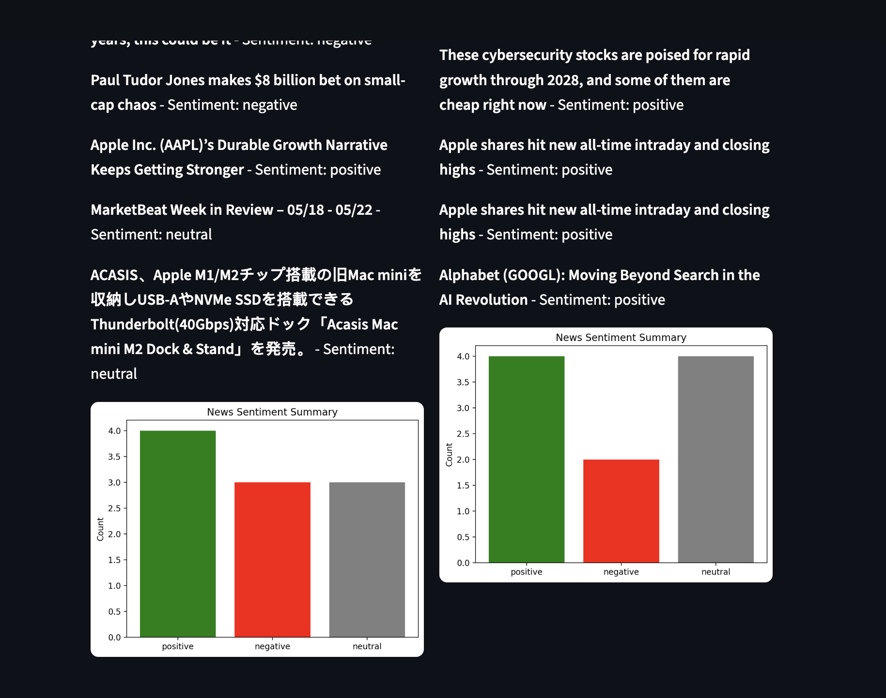

# Real-Time Stock Sentiment Analyzer
This project fetches real-time stock prices and news headlines, performs sentiment analysis, and visualizes the results.

## Screenshots

### Stock Price Comparison



### News Sentiment Comparison




## Features
- Fetch real-time stock prices using yfinance
- Fetch news headlines using NewsAPI
- Sentiment analysis using TextBlob
- Interactive dashboard with Streamlit
- Dockerized for easy deployment
- CI pipeline with GitHub Actions
- Sentiment Summary: Displays a bar chart of positive, negative, and neutral news counts for quick insights.

## Usage
1. Create a `.env` file in the project root and add your NewsAPI key:
```
NEWS_API_KEY=your_news_api_key_here
```
2. Install dependencies: `pip install -r requirements.txt`
3. Run app: `streamlit run src/app.py`
4. Select between **Real-Time** or **Sample Data** mode.
5. Enter stock ticker in the app.

```


